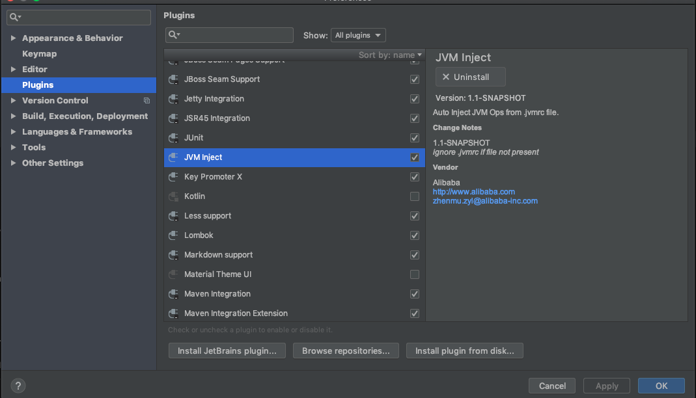

# 在IDEA中进行Java开发

> VPN模式由于是全局的，已经实现了系统级别的流量代理。 本文只适用于socks5代理模式

KT Connect在最新版本中0.0.8+[点击下载](https://alibaba.github.io/kt-connect/#/nightly)中支持与IDEA集成，从而可以帮助开发者直接在IDEA开发Java程序并直接调用Kubernetes集群中已有的服务。

## 实现原理

### 启动socks5代理服务

在IDEA的工作目录下使用ktctl启动本地到集群的socks5代理服务：

```
sudo ktctl -d connect --method=socks5
```

在运行完成后ktctl会自动在当前工作区生成.jvmrc文件，如下所示：

```
-DsocksProxyHost=127.0.0.1
-DsocksProxyPort=2223
```

### IDEA使用.jvmrc自动设置Java启动参数

下载并安装最新版本的[JVM Inject](https://plugins.jetbrains.com/plugin/13482-jvm-inject/versions)插件



JVM Inject插件会在Java程序启动时自动读取.jvmrc文件，并追加到程序的启动参数中，如下所示:


```
java ...省略的其他输出... -Djava.rmi.server.hostname=127.0.0.1 -Dspring.liveBeansView.mbeanDomain -Dspring.application.admin.enabled=true -Dhttp.proxyHost=127.0.0.1 -Dhttp.proxyPort=2223 "-javaagent:/Applications/IntelliJ IDEA.app/Contents/lib/idea_rt.jar=58609:/Applications/IntelliJ IDEA.app/Contents/bin" ...省略的其他输出...  sample.Application
```

通过设置-Dhttp.proxyHost和-Dhttp.proxyPort启动参数，在Java程序中所有网络请求完全通过KT Connect进行转发。从而可以直接在代码中访问Kubernetes集群中的服务。 

```
$ kubectl get svc spring-sample
NAME                   TYPE        CLUSTER-IP     EXTERNAL-IP   PORT(S)    AGE
spring-sample   ClusterIP   172.21.15.36   <none>        8080/TCP   160d
```

例如, 直接在代码中访问Kubernetes集群内的服务：

```java
@RestController
public class HelloController {

    @RequestMapping("/")
    public String index() {
        ResponseEntity<String> response = new RestTemplate().getForEntity("http://172.21.14.10:8080", String.class);
        return response.getBody();
    }

}
```